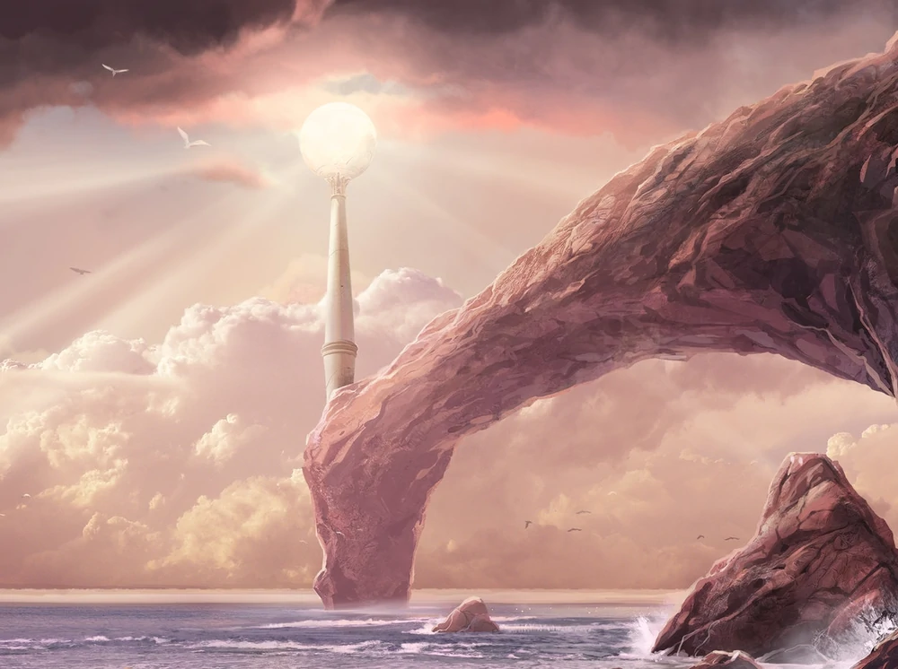

# Ormal

> Ormal, also known as High Gold, was the southern of the two Lamps of the Valar, set on the great tower Ringil by Aulë to bring light into the world of the Valar. 
-- https://lotr.fandom.com/wiki/Ormal

Ormal era a luz do mundo. Aqui vai ser a interface mesmo. Quem sabe um design system? Vomo ver. 🤙

Vou iniciar com o [Semantic UI](https://semantic-ui.com/) pra dar uma variada, mas se eu apanhar muito volto pro conforto do Bootstrap da massa. 🥲

O projeto completo pode ser acesso por [Helcaraxë](https://github.com/cleiver/helcaraxe). 🤓